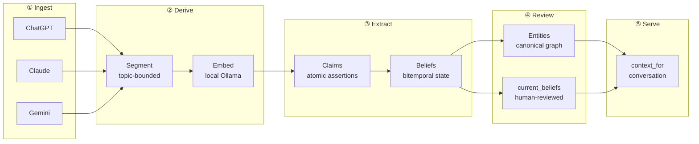
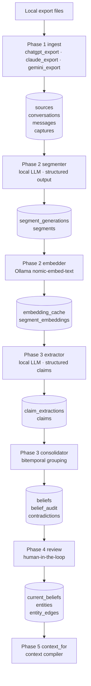

# engram

> A local-first memory layer for one human life.

Every AI conversation starts from scratch. You re-explain your projects, your preferences, your decisions, and your relationships — every time, to every assistant. Engram fixes that by building a private memory layer from your AI conversation history, entirely on your own machine.

The core promise: **no cloud dependency, no telemetry, no user data leaving the machine unless you explicitly ask for it.** Your corpus stays yours.

---

## The Problem

You've had thousands of conversations with AI assistants. They contain your project history, your working preferences, your decisions, your open questions, and your relationships with people and ideas. But each new session is blank. You paste old context, re-explain things you've explained before, and accept that assistants can only know what you tell them right now.

Hosted memory services solve this — by uploading your private history to someone else's server. Engram does not.

---

## What Engram Does

Engram turns your local AI conversation exports into a structured, searchable, evidence-backed memory layer. It runs entirely on your machine using local models and local Postgres.

- **Ingests** ChatGPT, Claude, and Gemini exports into an immutable raw evidence store
- **Segments** conversation history into coherent topic units (not isolated turns, not whole conversations)
- **Embeds** those segments with a local model for semantic retrieval
- **Extracts** grounded, atomic claims using a deterministic local LLM contract
- **Consolidates** claims into bitemporal beliefs — with provenance, confidence, contradiction tracking, and a full audit trail
- **Reviews** beliefs through a human-in-the-loop interface; builds a canonical entity graph
- **Serves** *(Phase 5, in progress)* compact, evidence-backed context packages via `context_for(conversation)`

The end state is a local context compiler: point it at a new conversation and it returns a structured block of what the assistant needs to know — grounded in your actual history, not invented.

---

## How It Works



Each stage is independently rebuildable. A bad extraction can be superseded without touching raw evidence. A bad consolidation can be rebuilt from claims. The raw message that caused any error is always preserved, unchanged, with its original provenance.

---

## Architecture

Engram is a layered storage model. Each layer separates a distinct concern:

```
┌───────────────────────────────────────────────────────────┐
│              context_for(conversation)                    │
│      compact evidence-backed context · Phase 5            │
├───────────────────────────────────────────────────────────┤
│         entities · current_beliefs                        │
│      canonical entity graph · human review · Phase 4      │
├───────────────────────────────────────────────────────────┤
│      claims · beliefs · contradictions · audit            │
│   bitemporal state · provenance · confidence · Phase 3    │
├───────────────────────────────────────────────────────────┤
│              segments · embeddings                        │
│      topic-bounded · versioned · local model · Phase 2    │
├───────────────────────────────────────────────────────────┤
│   sources · conversations · messages · notes · captures   │
│         immutable raw evidence · append-only · Phase 1    │
└───────────────────────────────────────────────────────────┘
         ▲                                       ▲
    local exports                          local Postgres
    (your files)                            (your machine)
```

Mixing evidence and belief state is the fastest way to manufacture confident nonsense. Engram keeps them separate by design. Every belief carries a link back to the raw message that produced it.

### Data Flow (Detail)



---

## Design Principles

**Raw evidence is sacred.** Ingestion is idempotent. Re-ingestion must succeed cleanly or fail; it must never silently overwrite prior evidence. Database triggers enforce append-only semantics on raw tables.

**Derived data is rebuildable.** Segments, embeddings, extractions, and beliefs carry prompt/model/version metadata. Newer derivations supersede older ones without destroying history.

**Provenance is non-negotiable.** Every belief links back to the claim that produced it, and every claim links back to the raw segment it came from. The system pays for traceability so future review and correction can explain *why* a memory exists.

**No false precision.** "No claim found" is a real, recordable result. The live serving path will use a weighted scorer with explicit confidence and "no data" markers rather than LLM reranking that manufactures confident answers.

**Local only.** Model endpoint helpers reject non-local URLs. Web UIs refuse non-loopback bind addresses by default. No outbound network calls are made from any phase unless you wire one explicitly.

---

## Current Status

The pipeline through Phase 4 is implemented and has been validated in bounded runs. Phase 5 (`context_for`) is the remaining serving surface.

| Phase | Area | Status |
|-------|------|--------|
| 1 | Raw evidence ingest — ChatGPT | Implemented |
| 1.5 | Multi-source ingest — Claude + Gemini | Implemented |
| 2 | Segmentation + embeddings | Implemented, AI-conversation corpus |
| 3 | Claim extraction + bitemporal beliefs | Implemented, operational validation complete |
| 3 | Gold-set interview (RFC 0021) | Implemented — append-only label authoring CLI + web UI |
| 4 | Entity canonicalization + belief review | Implemented — bounded; full-corpus gate pending |
| 5 | `context_for` + MCP serving | Not yet built |
| — | RFC 0044 Striatum memory ingest | Implemented — optional local application-memory tenant |

Phase 3 has been through several runtime repair loops. The bounded `pipeline-3 --limit 500` gate completed with zero extraction failures and zero consolidation skips. The first unbounded Phase 3 run surfaced a JSON-null group-key mismatch in the consolidator; that repair has targeted regression coverage and the full test suite passes.

---

## Operator Quick Start

### Install

```sh
make install
```

### Start Postgres

```sh
# Docker
make db-up
make migrate-docker

# Local (non-Docker)
make migrate
```

### Ingest exports

```sh
make phase1-ingest-chatgpt PATH=/path/to/chatgpt-export
make phase1-ingest-claude  PATH=/path/to/claude-export-or-zip
make phase1-ingest-gemini  PATH=/path/to/google-takeout
make phase1-ingest-striatum PATH=/path/to/striatum-bundle REPO=striatum
```

### Run the pipeline

```sh
# Phase 2: segment + embed
make phase2-run
make phase2-run LIMIT=25      # bounded test run

# Phase 3: extract + consolidate
make phase3-run
make phase3-run LIMIT=50      # bounded test run

# Phase 4: entity + review smoke check
make phase4-smoke LIMIT=25
```

### Useful targeted commands

```sh
# Bounded CLI runs
.venv/bin/python -m engram.cli phase2 segment --limit 10
.venv/bin/python -m engram.cli phase3 extract --limit 25
.venv/bin/python -m engram.cli phase3 consolidate --limit 25

# Phase 3 recovery
.venv/bin/python -m engram.cli phase3 extract --segment-id UUID
.venv/bin/python -m engram.cli phase3 extract --conversation-id UUID --requeue
.venv/bin/python -m engram.cli phase3 consolidate --rebuild

# Gold-set interview web UI
engram phase3 interview serve --host 127.0.0.1 --port 8765

# Striatum corpus read tools
.venv/bin/engram describe-corpus striatum
.venv/bin/engram-mcp-stdio --health-check
```

Docker variants (`make phase2-run-docker`, `make phase3-run-docker`, etc.) are available when Postgres is the compose-managed instance.

### Phase 3 follow-on: Gold-set interview

`engram phase3 interview` is the append-only gold-label authoring surface. See [docs/howto/gold-set-interview.md](docs/howto/gold-set-interview.md) for the operator guide — verdict glossary, cooldowns, privacy-tier export defaults, resume behavior, and strata filters.

### Tests and schema docs

```sh
make test
make schema-docs   # regenerate docs/schema/README.md after migrations
```

Do not edit [docs/schema/README.md](docs/schema/README.md) by hand.

---

## Stack

| Component | Implementation |
|-----------|----------------|
| Database | PostgreSQL + pgvector, local-only |
| Migrations | Plain SQL, filename + checksum identity |
| Embeddings | `nomic-embed-text` via Ollama |
| Local LLM stages | `qwen3.6-35b-a3b` via ik-llama |
| Application code | Python |
| Web UIs | FastAPI + Jinja2 (loopback-only, optional install) |
| Tests | pytest against a real local Postgres |

---

## Source Scope

| Source | Status | Notes |
|--------|--------|-------|
| ChatGPT JSON export | Implemented | Phase 1 ingest; Phase 2/3 AI-conversation substrate |
| Claude export ZIP/directory | Implemented | Phase 1.5 multi-source |
| Gemini Google Takeout | Implemented | Phase 1.5 multi-source |
| Striatum corpus export | Implemented | RFC 0044 — separate local tenant; read-only retrieval only |
| Obsidian vault | Schema-reserved / deferred | Not part of current Phase 2 or 3 runs |
| MCP live capture | Schema-reserved / deferred | Returns in later phases |

Phase 2 and Phase 3 intentionally operate on the AI-conversation corpus only (ChatGPT, Claude, Gemini). Notes, captures, and Obsidian-derived rows are future scope even where the schema already has room for them.

RFC 0044 adds a separate `tenant_id='striatum'` application-memory boundary. Engram reads the bundle from disk and exposes four read-only MCP stdio tools: `engram.search`, `engram.fetch_reference`, `engram.describe_corpus`, and `engram.health`. Personal memory stays outside that boundary.

---

## Repository Map

| Path | Purpose |
|------|---------|
| [src/engram](src/engram) | Python package and CLI |
| [migrations](migrations) | Forward SQL migrations |
| [tests](tests) | Unit and integration tests |
| [docs](docs) | Design docs, RFCs, reviews, runbooks, generated schema docs |
| [prompts](prompts) | Phase handoff and implementation prompts |
| [benchmarks](benchmarks) | Evaluation and benchmark scaffolding |
| [agent-runner](agent-runner) | Incubating generic terminal-agent orchestration; Engram is a reference use case, not its product boundary |

---

## Canonical Docs

Read these before older brainstorm, review, and prior-art material:

| Document | Purpose |
|----------|---------|
| [HUMAN_REQUIREMENTS.md](HUMAN_REQUIREMENTS.md) | Load-bearing principles and long-arc ambition |
| [DECISION_LOG.md](DECISION_LOG.md) | Accepted, rejected, superseded, and deferred decisions |
| [BUILD_PHASES.md](BUILD_PHASES.md) | V1 phase boundaries and acceptance criteria |
| [ROADMAP.md](ROADMAP.md) | Owner sequencing and attention artifact |
| [SPEC.md](SPEC.md) | Current architecture summary |
| [docs/README.md](docs/README.md) | Map of design docs, RFCs, reviews, and historical material |
| [docs/segmentation.md](docs/segmentation.md) | Phase 2 segmentation behavior and operations |
| [docs/claims_beliefs.md](docs/claims_beliefs.md) | Phase 3 claim extraction and belief consolidation contract |
| [docs/schema/README.md](docs/schema/README.md) | Generated schema diagram and table reference |
| [docs/reviews/phase3/](docs/reviews/phase3/) | Phase 3 build, review, and runtime validation trail |

---

## Explicitly Deferred

- Auto wiki writeback to Obsidian
- Goal, failure, hypothesis, pattern, and causal-link inference
- LLM cross-encoder reranking in the live path
- Alternative graph backends (Apache AGE, Neo4j, Kuzu, FalkorDB)
- Bidirectional Obsidian sync
- Bulk Evernote migration
- Note/capture/Obsidian claim extraction
- Belief embeddings, `context_for`, MCP serving, and `context_feedback` until their scheduled phases

---

## Inspiration

- Stash: early consolidation-pipeline inspiration; not the current schema
- OB1: MCP capture/tooling pattern
- Graphiti, Mem0, Letta, GraphRAG, and older Memex-style systems: reference points, not architecture templates
