# Engram Schema

> Auto-generated by `make schema-docs`. Do not edit by hand.

## Entity-Relationship Diagram

```mermaid
erDiagram
    audit_reason_vocabulary {
        TEXT reason PK
        SMALLINT stage
        TEXT description
        BOOLEAN precludes_supported
    }
    belief_audit {
        UUID id PK
        UUID belief_id
        TEXT transition_kind
        TEXT previous_status
        TEXT new_status
        TIMESTAMPTZ previous_valid_to
        TIMESTAMPTZ new_valid_to
        TEXT prompt_version
        TEXT model_version
        UUID[] input_claim_ids
        UUID[] evidence_message_ids
        JSONB score_breakdown
        UUID request_uuid
        TIMESTAMPTZ created_at
    }
    belief_review_actions {
        UUID id PK
        UUID belief_id
        TEXT action_kind
        TEXT action_status
        UUID capture_id
        UUID request_uuid
        TEXT actor
        TEXT note
        JSONB raw_payload
        TIMESTAMPTZ created_at
    }
    beliefs {
        UUID id PK
        TEXT subject_text
        TEXT subject_normalized
        TEXT predicate
        TEXT cardinality_class
        TEXT object_text
        JSONB object_json
        TEXT group_object_key
        TIMESTAMPTZ valid_from
        TIMESTAMPTZ valid_to
        TIMESTAMPTZ closed_at
        TIMESTAMPTZ observed_at
        TIMESTAMPTZ recorded_at
        TIMESTAMPTZ extracted_at
        UUID superseded_by
        TEXT status
        TEXT stability_class
        FLOAT confidence
        UUID[] evidence_ids
        UUID[] claim_ids
        TEXT prompt_version
        TEXT model_version
        INT privacy_tier
        JSONB raw_payload
    }
    captures {
        UUID id PK
        UUID source_id
        SOURCE_KIND source_kind
        TEXT external_id
        TIMESTAMPTZ imported_at
        JSONB raw_payload
        INT privacy_tier
        CAPTURE_TYPE capture_type
        UUID corrects_belief_id
        TEXT content_text
        TIMESTAMPTZ observed_at
    }
    claim_audits {
        UUID id PK
        UUID claim_id
        SMALLINT stage
        TEXT verdict
        TEXT[] audit_reasons
        TEXT auditor_model_version
        TEXT auditor_prompt_version
        TIMESTAMPTZ audited_at
        JSONB raw_payload
    }
    claim_extractions {
        UUID id PK
        UUID segment_id
        UUID generation_id
        TEXT extraction_prompt_version
        TEXT extraction_model_version
        TEXT request_profile_version
        TEXT status
        INT claim_count
        TIMESTAMPTZ created_at
        TIMESTAMPTZ completed_at
        JSONB raw_payload
    }
    claims {
        UUID id PK
        UUID segment_id
        UUID generation_id
        UUID conversation_id
        UUID extraction_id
        TEXT subject_text
        TEXT subject_normalized
        TEXT predicate
        TEXT object_text
        JSONB object_json
        TEXT stability_class
        FLOAT confidence
        UUID[] evidence_message_ids
        TEXT extraction_prompt_version
        TEXT extraction_model_version
        TEXT request_profile_version
        INT privacy_tier
        TIMESTAMPTZ extracted_at
        JSONB raw_payload
    }
    consolidation_progress {
        UUID id PK
        TEXT stage
        TEXT scope
        CONSOLIDATION_STATUS status
        TIMESTAMPTZ started_at
        TIMESTAMPTZ updated_at
        JSONB position
        INT error_count
        TEXT last_error
    }
    contradictions {
        UUID id PK
        UUID belief_a_id
        UUID belief_b_id
        TIMESTAMPTZ detected_at
        TEXT detection_kind
        TEXT resolution_status
        TEXT resolution_kind
        TIMESTAMPTZ resolved_at
        INT privacy_tier
        JSONB raw_payload
    }
    conversations {
        UUID id PK
        UUID source_id
        SOURCE_KIND source_kind
        TEXT external_id
        TIMESTAMPTZ imported_at
        JSONB raw_payload
        INT privacy_tier
        TEXT title
        TIMESTAMPTZ created_at
        TIMESTAMPTZ updated_at
    }
    embedding_cache {
        UUID id PK
        TEXT input_sha256
        TEXT embedding_model_version
        INT embedding_dimension
        VECTOR embedding
        TIMESTAMPTZ created_at
    }
    entities {
        UUID id PK
        TEXT entity_kind
        TEXT canonical_text
        TEXT canonical_key
        TEXT status
        FLOAT confidence
        UUID[] source_belief_ids
        UUID[] source_claim_ids
        UUID[] evidence_ids
        INT privacy_tier
        TEXT resolution_method
        TEXT resolution_version
        TIMESTAMPTZ created_at
        TIMESTAMPTZ superseded_at
        JSONB raw_payload
    }
    entity_edges {
        UUID id PK
        UUID source_entity_id
        UUID target_entity_id
        TEXT edge_kind
        TEXT status
        FLOAT confidence
        UUID[] source_belief_ids
        UUID[] source_claim_ids
        UUID[] evidence_ids
        INT privacy_tier
        TEXT resolution_version
        TIMESTAMPTZ created_at
        TIMESTAMPTZ superseded_at
        JSONB raw_payload
    }
    entity_resolution_events {
        UUID id PK
        UUID entity_id
        UUID related_entity_id
        TEXT event_kind
        UUID[] source_belief_ids
        UUID[] source_claim_ids
        UUID[] evidence_ids
        TEXT resolution_method
        TEXT resolution_version
        TEXT actor
        INT privacy_tier
        JSONB raw_payload
        TIMESTAMPTZ created_at
    }
    messages {
        UUID id PK
        UUID source_id
        SOURCE_KIND source_kind
        UUID conversation_id
        TEXT external_id
        TIMESTAMPTZ imported_at
        JSONB raw_payload
        INT privacy_tier
        TEXT role
        TEXT content_text
        TIMESTAMPTZ created_at
        INT sequence_index
    }
    notes {
        UUID id PK
        UUID source_id
        SOURCE_KIND source_kind
        TEXT external_id
        TIMESTAMPTZ imported_at
        JSONB raw_payload
        TEXT title
        TEXT content_text
        TIMESTAMPTZ created_at
        TIMESTAMPTZ updated_at
        INT privacy_tier
    }
    pinned_beliefs {
        UUID belief_id PK
        TIMESTAMPTZ pinned_at
        UUID request_uuid
        TEXT actor
        JSONB raw_payload
    }
    predicate_vocabulary {
        TEXT predicate PK
        TEXT stability_class
        TEXT cardinality_class
        TEXT object_kind
        TEXT[] group_object_keys
        TEXT[] required_object_keys
        TEXT description
    }
    projection_audits {
        UUID id PK
        TEXT projection_kind
        TEXT projection_ref
        UUID[] cited_claim_ids
        TEXT verdict
        TEXT[] audit_reasons
        TEXT auditor_model_version
        TEXT auditor_prompt_version
        TIMESTAMPTZ audited_at
        JSONB raw_payload
    }
    segment_embeddings {
        UUID segment_id PK
        UUID generation_id
        UUID embedding_cache_id
        VECTOR embedding
        TEXT embedding_model_version PK
        INT embedding_dimension
        BOOLEAN is_active
        INT privacy_tier
        TIMESTAMPTZ created_at
    }
    segment_generations {
        UUID id PK
        TEXT parent_kind
        UUID parent_id
        TEXT segmenter_prompt_version
        TEXT segmenter_model_version
        TEXT status
        TIMESTAMPTZ created_at
        TIMESTAMPTZ activated_at
        TIMESTAMPTZ superseded_at
        JSONB raw_payload
    }
    segments {
        UUID id PK
        UUID generation_id
        UUID source_id
        SOURCE_KIND source_kind
        UUID conversation_id
        UUID note_id
        UUID capture_id
        UUID[] message_ids
        INT sequence_index
        TEXT content_text
        TEXT summary_text
        TEXT window_strategy
        INT window_index
        TEXT segmenter_prompt_version
        TEXT segmenter_model_version
        BOOLEAN is_active
        TIMESTAMPTZ invalidated_at
        TEXT invalidation_reason
        INT privacy_tier
        TIMESTAMPTZ created_at
        JSONB raw_payload
    }
    sources {
        UUID id PK
        SOURCE_KIND source_kind
        TEXT external_id
        TIMESTAMPTZ imported_at
        TEXT filesystem_path
        TEXT content_hash
        JSONB raw_payload
    }
    belief_audit }o--|| beliefs : "belief_id"
    belief_review_actions }o--|| beliefs : "belief_id"
    belief_review_actions }o--|| captures : "capture_id"
    beliefs }o--|| predicate_vocabulary : "predicate"
    beliefs }o--|| beliefs : "superseded_by"
    captures }o--|| sources : "source_id"
    claim_audits }o--|| claims : "claim_id"
    claim_extractions }o--|| segment_generations : "generation_id"
    claim_extractions }o--|| segments : "segment_id"
    claims }o--|| conversations : "conversation_id"
    claims }o--|| claim_extractions : "extraction_id"
    claims }o--|| segment_generations : "generation_id"
    claims }o--|| predicate_vocabulary : "predicate"
    claims }o--|| segments : "segment_id"
    contradictions }o--|| beliefs : "belief_a_id"
    contradictions }o--|| beliefs : "belief_b_id"
    conversations }o--|| sources : "source_id"
    entity_edges }o--|| entities : "source_entity_id"
    entity_edges }o--|| entities : "target_entity_id"
    entity_resolution_events }o--|| entities : "entity_id"
    entity_resolution_events }o--|| entities : "related_entity_id"
    messages }o--|| conversations : "conversation_id"
    messages }o--|| sources : "source_id"
    notes }o--|| sources : "source_id"
    pinned_beliefs }o--|| beliefs : "belief_id"
    segment_embeddings }o--|| embedding_cache : "embedding_cache_id"
    segment_embeddings }o--|| segment_generations : "generation_id"
    segment_embeddings }o--|| segments : "segment_id"
    segments }o--|| captures : "capture_id"
    segments }o--|| conversations : "conversation_id"
    segments }o--|| segment_generations : "generation_id"
    segments }o--|| notes : "note_id"
    segments }o--|| sources : "source_id"
```

## Tables

## audit_reason_vocabulary

| Column | Type | Nullable | Default |
|--------|------|----------|---------|
| `reason` **PK** | `TEXT` | NO | `` |
| `stage` | `SMALLINT` | NO | `` |
| `description` | `TEXT` | NO | `` |
| `precludes_supported` | `BOOLEAN` | NO | `false` |

## belief_audit

| Column | Type | Nullable | Default |
|--------|------|----------|---------|
| `id` **PK** | `UUID` | NO | `gen_random_uuid()` |
| `belief_id` | `UUID` | NO | `` |
| `transition_kind` | `TEXT` | NO | `` |
| `previous_status` | `TEXT` | YES | `` |
| `new_status` | `TEXT` | NO | `` |
| `previous_valid_to` | `TIMESTAMPTZ` | YES | `` |
| `new_valid_to` | `TIMESTAMPTZ` | YES | `` |
| `prompt_version` | `TEXT` | NO | `` |
| `model_version` | `TEXT` | NO | `` |
| `input_claim_ids` | `UUID[]` | YES | `` |
| `evidence_message_ids` | `UUID[]` | NO | `'{}'::uuid[]` |
| `score_breakdown` | `JSONB` | NO | `'{}'::jsonb` |
| `request_uuid` | `UUID` | NO | `` |
| `created_at` | `TIMESTAMPTZ` | NO | `now()` |

## belief_review_actions

| Column | Type | Nullable | Default |
|--------|------|----------|---------|
| `id` **PK** | `UUID` | NO | `gen_random_uuid()` |
| `belief_id` | `UUID` | NO | `` |
| `action_kind` | `TEXT` | NO | `` |
| `action_status` | `TEXT` | NO | `` |
| `capture_id` | `UUID` | YES | `` |
| `request_uuid` | `UUID` | NO | `` |
| `actor` | `TEXT` | NO | `` |
| `note` | `TEXT` | YES | `` |
| `raw_payload` | `JSONB` | NO | `'{}'::jsonb` |
| `created_at` | `TIMESTAMPTZ` | NO | `now()` |

## beliefs

| Column | Type | Nullable | Default |
|--------|------|----------|---------|
| `id` **PK** | `UUID` | NO | `gen_random_uuid()` |
| `subject_text` | `TEXT` | NO | `` |
| `subject_normalized` | `TEXT` | NO | `` |
| `predicate` | `TEXT` | NO | `` |
| `cardinality_class` | `TEXT` | NO | `` |
| `object_text` | `TEXT` | YES | `` |
| `object_json` | `JSONB` | YES | `` |
| `group_object_key` | `TEXT` | NO | `''::text` |
| `valid_from` | `TIMESTAMPTZ` | NO | `` |
| `valid_to` | `TIMESTAMPTZ` | YES | `` |
| `closed_at` | `TIMESTAMPTZ` | YES | `` |
| `observed_at` | `TIMESTAMPTZ` | NO | `` |
| `recorded_at` | `TIMESTAMPTZ` | NO | `now()` |
| `extracted_at` | `TIMESTAMPTZ` | NO | `` |
| `superseded_by` | `UUID` | YES | `` |
| `status` | `TEXT` | NO | `` |
| `stability_class` | `TEXT` | NO | `` |
| `confidence` | `FLOAT` | NO | `` |
| `evidence_ids` | `UUID[]` | NO | `` |
| `claim_ids` | `UUID[]` | NO | `` |
| `prompt_version` | `TEXT` | NO | `` |
| `model_version` | `TEXT` | NO | `` |
| `privacy_tier` | `INT` | NO | `` |
| `raw_payload` | `JSONB` | NO | `` |

## captures

| Column | Type | Nullable | Default |
|--------|------|----------|---------|
| `id` **PK** | `UUID` | NO | `gen_random_uuid()` |
| `source_id` | `UUID` | NO | `` |
| `source_kind` | `SOURCE_KIND` | NO | `` |
| `external_id` | `TEXT` | NO | `` |
| `imported_at` | `TIMESTAMPTZ` | NO | `now()` |
| `raw_payload` | `JSONB` | NO | `` |
| `privacy_tier` | `INT` | NO | `1` |
| `capture_type` | `CAPTURE_TYPE` | NO | `` |
| `corrects_belief_id` | `UUID` | YES | `` |
| `content_text` | `TEXT` | YES | `` |
| `observed_at` | `TIMESTAMPTZ` | YES | `` |

## claim_audits

| Column | Type | Nullable | Default |
|--------|------|----------|---------|
| `id` **PK** | `UUID` | NO | `gen_random_uuid()` |
| `claim_id` | `UUID` | NO | `` |
| `stage` | `SMALLINT` | NO | `` |
| `verdict` | `TEXT` | YES | `` |
| `audit_reasons` | `TEXT[]` | NO | `'{}'::text[]` |
| `auditor_model_version` | `TEXT` | NO | `` |
| `auditor_prompt_version` | `TEXT` | NO | `` |
| `audited_at` | `TIMESTAMPTZ` | NO | `now()` |
| `raw_payload` | `JSONB` | NO | `'{}'::jsonb` |

## claim_extractions

| Column | Type | Nullable | Default |
|--------|------|----------|---------|
| `id` **PK** | `UUID` | NO | `gen_random_uuid()` |
| `segment_id` | `UUID` | NO | `` |
| `generation_id` | `UUID` | NO | `` |
| `extraction_prompt_version` | `TEXT` | NO | `` |
| `extraction_model_version` | `TEXT` | NO | `` |
| `request_profile_version` | `TEXT` | NO | `` |
| `status` | `TEXT` | NO | `` |
| `claim_count` | `INT` | NO | `0` |
| `created_at` | `TIMESTAMPTZ` | NO | `now()` |
| `completed_at` | `TIMESTAMPTZ` | YES | `` |
| `raw_payload` | `JSONB` | NO | `'{}'::jsonb` |

## claims

| Column | Type | Nullable | Default |
|--------|------|----------|---------|
| `id` **PK** | `UUID` | NO | `gen_random_uuid()` |
| `segment_id` | `UUID` | NO | `` |
| `generation_id` | `UUID` | NO | `` |
| `conversation_id` | `UUID` | YES | `` |
| `extraction_id` | `UUID` | NO | `` |
| `subject_text` | `TEXT` | NO | `` |
| `subject_normalized` | `TEXT` | NO | `` |
| `predicate` | `TEXT` | NO | `` |
| `object_text` | `TEXT` | YES | `` |
| `object_json` | `JSONB` | YES | `` |
| `stability_class` | `TEXT` | NO | `` |
| `confidence` | `FLOAT` | NO | `` |
| `evidence_message_ids` | `UUID[]` | NO | `` |
| `extraction_prompt_version` | `TEXT` | NO | `` |
| `extraction_model_version` | `TEXT` | NO | `` |
| `request_profile_version` | `TEXT` | NO | `` |
| `privacy_tier` | `INT` | NO | `` |
| `extracted_at` | `TIMESTAMPTZ` | NO | `now()` |
| `raw_payload` | `JSONB` | NO | `` |

## consolidation_progress

| Column | Type | Nullable | Default |
|--------|------|----------|---------|
| `id` **PK** | `UUID` | NO | `gen_random_uuid()` |
| `stage` | `TEXT` | NO | `` |
| `scope` | `TEXT` | NO | `` |
| `status` | `CONSOLIDATION_STATUS` | NO | `'pending'::consolidation_status` |
| `started_at` | `TIMESTAMPTZ` | YES | `` |
| `updated_at` | `TIMESTAMPTZ` | NO | `now()` |
| `position` | `JSONB` | NO | `'{}'::jsonb` |
| `error_count` | `INT` | NO | `0` |
| `last_error` | `TEXT` | YES | `` |

## contradictions

| Column | Type | Nullable | Default |
|--------|------|----------|---------|
| `id` **PK** | `UUID` | NO | `gen_random_uuid()` |
| `belief_a_id` | `UUID` | NO | `` |
| `belief_b_id` | `UUID` | NO | `` |
| `detected_at` | `TIMESTAMPTZ` | NO | `now()` |
| `detection_kind` | `TEXT` | NO | `` |
| `resolution_status` | `TEXT` | NO | `'open'::text` |
| `resolution_kind` | `TEXT` | YES | `` |
| `resolved_at` | `TIMESTAMPTZ` | YES | `` |
| `privacy_tier` | `INT` | NO | `` |
| `raw_payload` | `JSONB` | NO | `'{}'::jsonb` |

## conversations

| Column | Type | Nullable | Default |
|--------|------|----------|---------|
| `id` **PK** | `UUID` | NO | `gen_random_uuid()` |
| `source_id` | `UUID` | NO | `` |
| `source_kind` | `SOURCE_KIND` | NO | `` |
| `external_id` | `TEXT` | NO | `` |
| `imported_at` | `TIMESTAMPTZ` | NO | `now()` |
| `raw_payload` | `JSONB` | NO | `` |
| `privacy_tier` | `INT` | NO | `1` |
| `title` | `TEXT` | YES | `` |
| `created_at` | `TIMESTAMPTZ` | YES | `` |
| `updated_at` | `TIMESTAMPTZ` | YES | `` |

## embedding_cache

| Column | Type | Nullable | Default |
|--------|------|----------|---------|
| `id` **PK** | `UUID` | NO | `gen_random_uuid()` |
| `input_sha256` | `TEXT` | NO | `` |
| `embedding_model_version` | `TEXT` | NO | `` |
| `embedding_dimension` | `INT` | NO | `` |
| `embedding` | `VECTOR` | NO | `` |
| `created_at` | `TIMESTAMPTZ` | NO | `now()` |

## entities

| Column | Type | Nullable | Default |
|--------|------|----------|---------|
| `id` **PK** | `UUID` | NO | `gen_random_uuid()` |
| `entity_kind` | `TEXT` | NO | `` |
| `canonical_text` | `TEXT` | NO | `` |
| `canonical_key` | `TEXT` | NO | `` |
| `status` | `TEXT` | NO | `` |
| `confidence` | `FLOAT` | NO | `` |
| `source_belief_ids` | `UUID[]` | NO | `` |
| `source_claim_ids` | `UUID[]` | NO | `'{}'::uuid[]` |
| `evidence_ids` | `UUID[]` | NO | `` |
| `privacy_tier` | `INT` | NO | `` |
| `resolution_method` | `TEXT` | NO | `` |
| `resolution_version` | `TEXT` | NO | `` |
| `created_at` | `TIMESTAMPTZ` | NO | `now()` |
| `superseded_at` | `TIMESTAMPTZ` | YES | `` |
| `raw_payload` | `JSONB` | NO | `'{}'::jsonb` |

## entity_edges

| Column | Type | Nullable | Default |
|--------|------|----------|---------|
| `id` **PK** | `UUID` | NO | `gen_random_uuid()` |
| `source_entity_id` | `UUID` | NO | `` |
| `target_entity_id` | `UUID` | NO | `` |
| `edge_kind` | `TEXT` | NO | `` |
| `status` | `TEXT` | NO | `` |
| `confidence` | `FLOAT` | NO | `` |
| `source_belief_ids` | `UUID[]` | NO | `` |
| `source_claim_ids` | `UUID[]` | NO | `'{}'::uuid[]` |
| `evidence_ids` | `UUID[]` | NO | `` |
| `privacy_tier` | `INT` | NO | `` |
| `resolution_version` | `TEXT` | NO | `` |
| `created_at` | `TIMESTAMPTZ` | NO | `now()` |
| `superseded_at` | `TIMESTAMPTZ` | YES | `` |
| `raw_payload` | `JSONB` | NO | `'{}'::jsonb` |

## entity_resolution_events

| Column | Type | Nullable | Default |
|--------|------|----------|---------|
| `id` **PK** | `UUID` | NO | `gen_random_uuid()` |
| `entity_id` | `UUID` | NO | `` |
| `related_entity_id` | `UUID` | YES | `` |
| `event_kind` | `TEXT` | NO | `` |
| `source_belief_ids` | `UUID[]` | NO | `` |
| `source_claim_ids` | `UUID[]` | NO | `'{}'::uuid[]` |
| `evidence_ids` | `UUID[]` | NO | `` |
| `resolution_method` | `TEXT` | NO | `` |
| `resolution_version` | `TEXT` | NO | `` |
| `actor` | `TEXT` | NO | `` |
| `privacy_tier` | `INT` | NO | `` |
| `raw_payload` | `JSONB` | NO | `'{}'::jsonb` |
| `created_at` | `TIMESTAMPTZ` | NO | `now()` |

## messages

| Column | Type | Nullable | Default |
|--------|------|----------|---------|
| `id` **PK** | `UUID` | NO | `gen_random_uuid()` |
| `source_id` | `UUID` | NO | `` |
| `source_kind` | `SOURCE_KIND` | NO | `` |
| `conversation_id` | `UUID` | NO | `` |
| `external_id` | `TEXT` | NO | `` |
| `imported_at` | `TIMESTAMPTZ` | NO | `now()` |
| `raw_payload` | `JSONB` | NO | `` |
| `privacy_tier` | `INT` | NO | `1` |
| `role` | `TEXT` | YES | `` |
| `content_text` | `TEXT` | YES | `` |
| `created_at` | `TIMESTAMPTZ` | YES | `` |
| `sequence_index` | `INT` | NO | `` |

## notes

| Column | Type | Nullable | Default |
|--------|------|----------|---------|
| `id` **PK** | `UUID` | NO | `gen_random_uuid()` |
| `source_id` | `UUID` | NO | `` |
| `source_kind` | `SOURCE_KIND` | NO | `` |
| `external_id` | `TEXT` | NO | `` |
| `imported_at` | `TIMESTAMPTZ` | NO | `now()` |
| `raw_payload` | `JSONB` | NO | `` |
| `title` | `TEXT` | YES | `` |
| `content_text` | `TEXT` | YES | `` |
| `created_at` | `TIMESTAMPTZ` | YES | `` |
| `updated_at` | `TIMESTAMPTZ` | YES | `` |
| `privacy_tier` | `INT` | NO | `1` |

## pinned_beliefs

| Column | Type | Nullable | Default |
|--------|------|----------|---------|
| `belief_id` **PK** | `UUID` | NO | `` |
| `pinned_at` | `TIMESTAMPTZ` | NO | `now()` |
| `request_uuid` | `UUID` | NO | `` |
| `actor` | `TEXT` | NO | `` |
| `raw_payload` | `JSONB` | NO | `'{}'::jsonb` |

## predicate_vocabulary

| Column | Type | Nullable | Default |
|--------|------|----------|---------|
| `predicate` **PK** | `TEXT` | NO | `` |
| `stability_class` | `TEXT` | NO | `` |
| `cardinality_class` | `TEXT` | NO | `` |
| `object_kind` | `TEXT` | NO | `` |
| `group_object_keys` | `TEXT[]` | NO | `'{}'::text[]` |
| `required_object_keys` | `TEXT[]` | NO | `'{}'::text[]` |
| `description` | `TEXT` | NO | `` |

## projection_audits

| Column | Type | Nullable | Default |
|--------|------|----------|---------|
| `id` **PK** | `UUID` | NO | `gen_random_uuid()` |
| `projection_kind` | `TEXT` | NO | `` |
| `projection_ref` | `TEXT` | NO | `` |
| `cited_claim_ids` | `UUID[]` | NO | `` |
| `verdict` | `TEXT` | NO | `` |
| `audit_reasons` | `TEXT[]` | NO | `'{}'::text[]` |
| `auditor_model_version` | `TEXT` | NO | `` |
| `auditor_prompt_version` | `TEXT` | NO | `` |
| `audited_at` | `TIMESTAMPTZ` | NO | `now()` |
| `raw_payload` | `JSONB` | NO | `'{}'::jsonb` |

## segment_embeddings

| Column | Type | Nullable | Default |
|--------|------|----------|---------|
| `segment_id` **PK** | `UUID` | NO | `` |
| `generation_id` | `UUID` | NO | `` |
| `embedding_cache_id` | `UUID` | NO | `` |
| `embedding` | `VECTOR` | NO | `` |
| `embedding_model_version` **PK** | `TEXT` | NO | `` |
| `embedding_dimension` | `INT` | NO | `` |
| `is_active` | `BOOLEAN` | NO | `false` |
| `privacy_tier` | `INT` | NO | `` |
| `created_at` | `TIMESTAMPTZ` | NO | `now()` |

## segment_generations

| Column | Type | Nullable | Default |
|--------|------|----------|---------|
| `id` **PK** | `UUID` | NO | `gen_random_uuid()` |
| `parent_kind` | `TEXT` | NO | `` |
| `parent_id` | `UUID` | NO | `` |
| `segmenter_prompt_version` | `TEXT` | NO | `` |
| `segmenter_model_version` | `TEXT` | NO | `` |
| `status` | `TEXT` | NO | `` |
| `created_at` | `TIMESTAMPTZ` | NO | `now()` |
| `activated_at` | `TIMESTAMPTZ` | YES | `` |
| `superseded_at` | `TIMESTAMPTZ` | YES | `` |
| `raw_payload` | `JSONB` | NO | `'{}'::jsonb` |

## segments

| Column | Type | Nullable | Default |
|--------|------|----------|---------|
| `id` **PK** | `UUID` | NO | `gen_random_uuid()` |
| `generation_id` | `UUID` | NO | `` |
| `source_id` | `UUID` | NO | `` |
| `source_kind` | `SOURCE_KIND` | NO | `` |
| `conversation_id` | `UUID` | YES | `` |
| `note_id` | `UUID` | YES | `` |
| `capture_id` | `UUID` | YES | `` |
| `message_ids` | `UUID[]` | NO | `` |
| `sequence_index` | `INT` | NO | `` |
| `content_text` | `TEXT` | NO | `` |
| `summary_text` | `TEXT` | YES | `` |
| `window_strategy` | `TEXT` | NO | `'whole'::text` |
| `window_index` | `INT` | YES | `` |
| `segmenter_prompt_version` | `TEXT` | NO | `` |
| `segmenter_model_version` | `TEXT` | NO | `` |
| `is_active` | `BOOLEAN` | NO | `false` |
| `invalidated_at` | `TIMESTAMPTZ` | YES | `` |
| `invalidation_reason` | `TEXT` | YES | `` |
| `privacy_tier` | `INT` | NO | `1` |
| `created_at` | `TIMESTAMPTZ` | NO | `now()` |
| `raw_payload` | `JSONB` | NO | `` |

## sources

| Column | Type | Nullable | Default |
|--------|------|----------|---------|
| `id` **PK** | `UUID` | NO | `gen_random_uuid()` |
| `source_kind` | `SOURCE_KIND` | NO | `` |
| `external_id` | `TEXT` | NO | `` |
| `imported_at` | `TIMESTAMPTZ` | NO | `now()` |
| `filesystem_path` | `TEXT` | YES | `` |
| `content_hash` | `TEXT` | YES | `` |
| `raw_payload` | `JSONB` | NO | `` |
