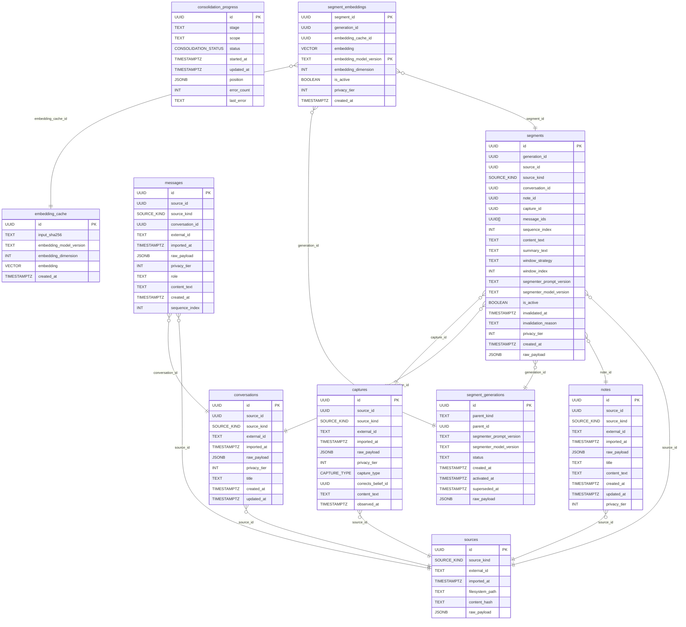

# Engram Schema

> Auto-generated by `make schema-docs`. Do not edit by hand.

## Entity-Relationship Diagram

## Tables

## captures

| Column | Type | Nullable | Default |
|--------|------|----------|---------|
| `id` **PK** | `UUID` | NO | `gen_random_uuid()` |
| `source_id` | `UUID` | NO | `` |
| `source_kind` | `SOURCE_KIND` | NO | `` |
| `external_id` | `TEXT` | NO | `` |
| `imported_at` | `TIMESTAMPTZ` | NO | `now()` |
| `raw_payload` | `JSONB` | NO | `` |
| `privacy_tier` | `INT` | NO | `1` |
| `capture_type` | `CAPTURE_TYPE` | NO | `` |
| `corrects_belief_id` | `UUID` | YES | `` |
| `content_text` | `TEXT` | YES | `` |
| `observed_at` | `TIMESTAMPTZ` | YES | `` |

## consolidation_progress

| Column | Type | Nullable | Default |
|--------|------|----------|---------|
| `id` **PK** | `UUID` | NO | `gen_random_uuid()` |
| `stage` | `TEXT` | NO | `` |
| `scope` | `TEXT` | NO | `` |
| `status` | `CONSOLIDATION_STATUS` | NO | `'pending'::consolidation_status` |
| `started_at` | `TIMESTAMPTZ` | YES | `` |
| `updated_at` | `TIMESTAMPTZ` | NO | `now()` |
| `position` | `JSONB` | NO | `'{}'::jsonb` |
| `error_count` | `INT` | NO | `0` |
| `last_error` | `TEXT` | YES | `` |

## conversations

| Column | Type | Nullable | Default |
|--------|------|----------|---------|
| `id` **PK** | `UUID` | NO | `gen_random_uuid()` |
| `source_id` | `UUID` | NO | `` |
| `source_kind` | `SOURCE_KIND` | NO | `` |
| `external_id` | `TEXT` | NO | `` |
| `imported_at` | `TIMESTAMPTZ` | NO | `now()` |
| `raw_payload` | `JSONB` | NO | `` |
| `privacy_tier` | `INT` | NO | `1` |
| `title` | `TEXT` | YES | `` |
| `created_at` | `TIMESTAMPTZ` | YES | `` |
| `updated_at` | `TIMESTAMPTZ` | YES | `` |

## embedding_cache

| Column | Type | Nullable | Default |
|--------|------|----------|---------|
| `id` **PK** | `UUID` | NO | `gen_random_uuid()` |
| `input_sha256` | `TEXT` | NO | `` |
| `embedding_model_version` | `TEXT` | NO | `` |
| `embedding_dimension` | `INT` | NO | `` |
| `embedding` | `VECTOR` | NO | `` |
| `created_at` | `TIMESTAMPTZ` | NO | `now()` |

## messages

| Column | Type | Nullable | Default |
|--------|------|----------|---------|
| `id` **PK** | `UUID` | NO | `gen_random_uuid()` |
| `source_id` | `UUID` | NO | `` |
| `source_kind` | `SOURCE_KIND` | NO | `` |
| `conversation_id` | `UUID` | NO | `` |
| `external_id` | `TEXT` | NO | `` |
| `imported_at` | `TIMESTAMPTZ` | NO | `now()` |
| `raw_payload` | `JSONB` | NO | `` |
| `privacy_tier` | `INT` | NO | `1` |
| `role` | `TEXT` | YES | `` |
| `content_text` | `TEXT` | YES | `` |
| `created_at` | `TIMESTAMPTZ` | YES | `` |
| `sequence_index` | `INT` | NO | `` |

## notes

| Column | Type | Nullable | Default |
|--------|------|----------|---------|
| `id` **PK** | `UUID` | NO | `gen_random_uuid()` |
| `source_id` | `UUID` | NO | `` |
| `source_kind` | `SOURCE_KIND` | NO | `` |
| `external_id` | `TEXT` | NO | `` |
| `imported_at` | `TIMESTAMPTZ` | NO | `now()` |
| `raw_payload` | `JSONB` | NO | `` |
| `title` | `TEXT` | YES | `` |
| `content_text` | `TEXT` | YES | `` |
| `created_at` | `TIMESTAMPTZ` | YES | `` |
| `updated_at` | `TIMESTAMPTZ` | YES | `` |
| `privacy_tier` | `INT` | NO | `1` |

## segment_embeddings

| Column | Type | Nullable | Default |
|--------|------|----------|---------|
| `segment_id` **PK** | `UUID` | NO | `` |
| `generation_id` | `UUID` | NO | `` |
| `embedding_cache_id` | `UUID` | NO | `` |
| `embedding` | `VECTOR` | NO | `` |
| `embedding_model_version` **PK** | `TEXT` | NO | `` |
| `embedding_dimension` | `INT` | NO | `` |
| `is_active` | `BOOLEAN` | NO | `false` |
| `privacy_tier` | `INT` | NO | `` |
| `created_at` | `TIMESTAMPTZ` | NO | `now()` |

## segment_generations

| Column | Type | Nullable | Default |
|--------|------|----------|---------|
| `id` **PK** | `UUID` | NO | `gen_random_uuid()` |
| `parent_kind` | `TEXT` | NO | `` |
| `parent_id` | `UUID` | NO | `` |
| `segmenter_prompt_version` | `TEXT` | NO | `` |
| `segmenter_model_version` | `TEXT` | NO | `` |
| `status` | `TEXT` | NO | `` |
| `created_at` | `TIMESTAMPTZ` | NO | `now()` |
| `activated_at` | `TIMESTAMPTZ` | YES | `` |
| `superseded_at` | `TIMESTAMPTZ` | YES | `` |
| `raw_payload` | `JSONB` | NO | `'{}'::jsonb` |

## segments

| Column | Type | Nullable | Default |
|--------|------|----------|---------|
| `id` **PK** | `UUID` | NO | `gen_random_uuid()` |
| `generation_id` | `UUID` | NO | `` |
| `source_id` | `UUID` | NO | `` |
| `source_kind` | `SOURCE_KIND` | NO | `` |
| `conversation_id` | `UUID` | YES | `` |
| `note_id` | `UUID` | YES | `` |
| `capture_id` | `UUID` | YES | `` |
| `message_ids` | `UUID[]` | NO | `` |
| `sequence_index` | `INT` | NO | `` |
| `content_text` | `TEXT` | NO | `` |
| `summary_text` | `TEXT` | YES | `` |
| `window_strategy` | `TEXT` | NO | `'whole'::text` |
| `window_index` | `INT` | YES | `` |
| `segmenter_prompt_version` | `TEXT` | NO | `` |
| `segmenter_model_version` | `TEXT` | NO | `` |
| `is_active` | `BOOLEAN` | NO | `false` |
| `invalidated_at` | `TIMESTAMPTZ` | YES | `` |
| `invalidation_reason` | `TEXT` | YES | `` |
| `privacy_tier` | `INT` | NO | `1` |
| `created_at` | `TIMESTAMPTZ` | NO | `now()` |
| `raw_payload` | `JSONB` | NO | `` |

## sources

| Column | Type | Nullable | Default |
|--------|------|----------|---------|
| `id` **PK** | `UUID` | NO | `gen_random_uuid()` |
| `source_kind` | `SOURCE_KIND` | NO | `` |
| `external_id` | `TEXT` | NO | `` |
| `imported_at` | `TIMESTAMPTZ` | NO | `now()` |
| `filesystem_path` | `TEXT` | YES | `` |
| `content_hash` | `TEXT` | YES | `` |
| `raw_payload` | `JSONB` | NO | `` |
