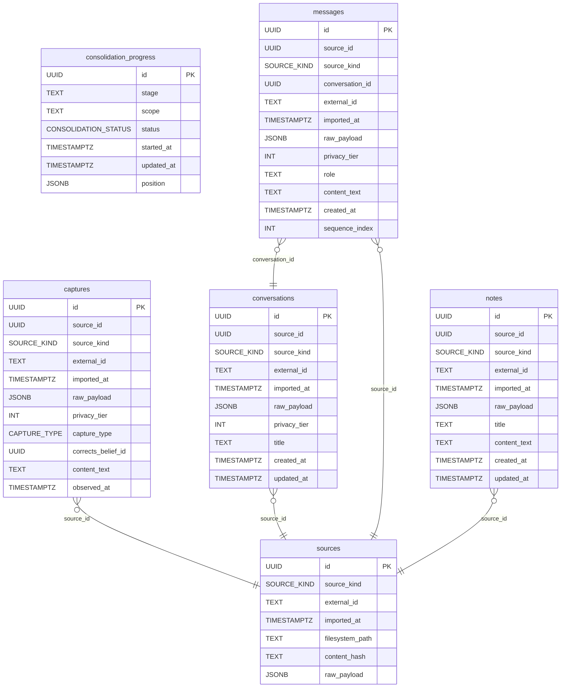

# Engram Schema

> Auto-generated by `make schema-docs`. Do not edit by hand.

## Entity-Relationship Diagram

## Tables

## captures

| Column | Type | Nullable | Default |
|--------|------|----------|---------|
| `id` **PK** | `UUID` | NO | `gen_random_uuid()` |
| `source_id` | `UUID` | NO | `` |
| `source_kind` | `SOURCE_KIND` | NO | `` |
| `external_id` | `TEXT` | NO | `` |
| `imported_at` | `TIMESTAMPTZ` | NO | `now()` |
| `raw_payload` | `JSONB` | NO | `` |
| `privacy_tier` | `INT` | NO | `1` |
| `capture_type` | `CAPTURE_TYPE` | NO | `` |
| `corrects_belief_id` | `UUID` | YES | `` |
| `content_text` | `TEXT` | YES | `` |
| `observed_at` | `TIMESTAMPTZ` | YES | `` |

## consolidation_progress

| Column | Type | Nullable | Default |
|--------|------|----------|---------|
| `id` **PK** | `UUID` | NO | `gen_random_uuid()` |
| `stage` | `TEXT` | NO | `` |
| `scope` | `TEXT` | NO | `` |
| `status` | `CONSOLIDATION_STATUS` | NO | `'pending'::consolidation_status` |
| `started_at` | `TIMESTAMPTZ` | YES | `` |
| `updated_at` | `TIMESTAMPTZ` | NO | `now()` |
| `position` | `JSONB` | NO | `'{}'::jsonb` |

## conversations

| Column | Type | Nullable | Default |
|--------|------|----------|---------|
| `id` **PK** | `UUID` | NO | `gen_random_uuid()` |
| `source_id` | `UUID` | NO | `` |
| `source_kind` | `SOURCE_KIND` | NO | `` |
| `external_id` | `TEXT` | NO | `` |
| `imported_at` | `TIMESTAMPTZ` | NO | `now()` |
| `raw_payload` | `JSONB` | NO | `` |
| `privacy_tier` | `INT` | NO | `1` |
| `title` | `TEXT` | YES | `` |
| `created_at` | `TIMESTAMPTZ` | YES | `` |
| `updated_at` | `TIMESTAMPTZ` | YES | `` |

## messages

| Column | Type | Nullable | Default |
|--------|------|----------|---------|
| `id` **PK** | `UUID` | NO | `gen_random_uuid()` |
| `source_id` | `UUID` | NO | `` |
| `source_kind` | `SOURCE_KIND` | NO | `` |
| `conversation_id` | `UUID` | NO | `` |
| `external_id` | `TEXT` | NO | `` |
| `imported_at` | `TIMESTAMPTZ` | NO | `now()` |
| `raw_payload` | `JSONB` | NO | `` |
| `privacy_tier` | `INT` | NO | `1` |
| `role` | `TEXT` | YES | `` |
| `content_text` | `TEXT` | YES | `` |
| `created_at` | `TIMESTAMPTZ` | YES | `` |
| `sequence_index` | `INT` | NO | `` |

## notes

| Column | Type | Nullable | Default |
|--------|------|----------|---------|
| `id` **PK** | `UUID` | NO | `gen_random_uuid()` |
| `source_id` | `UUID` | NO | `` |
| `source_kind` | `SOURCE_KIND` | NO | `` |
| `external_id` | `TEXT` | NO | `` |
| `imported_at` | `TIMESTAMPTZ` | NO | `now()` |
| `raw_payload` | `JSONB` | NO | `` |
| `title` | `TEXT` | YES | `` |
| `content_text` | `TEXT` | YES | `` |
| `created_at` | `TIMESTAMPTZ` | YES | `` |
| `updated_at` | `TIMESTAMPTZ` | YES | `` |

## sources

| Column | Type | Nullable | Default |
|--------|------|----------|---------|
| `id` **PK** | `UUID` | NO | `gen_random_uuid()` |
| `source_kind` | `SOURCE_KIND` | NO | `` |
| `external_id` | `TEXT` | NO | `` |
| `imported_at` | `TIMESTAMPTZ` | NO | `now()` |
| `filesystem_path` | `TEXT` | YES | `` |
| `content_hash` | `TEXT` | YES | `` |
| `raw_payload` | `JSONB` | NO | `` |
